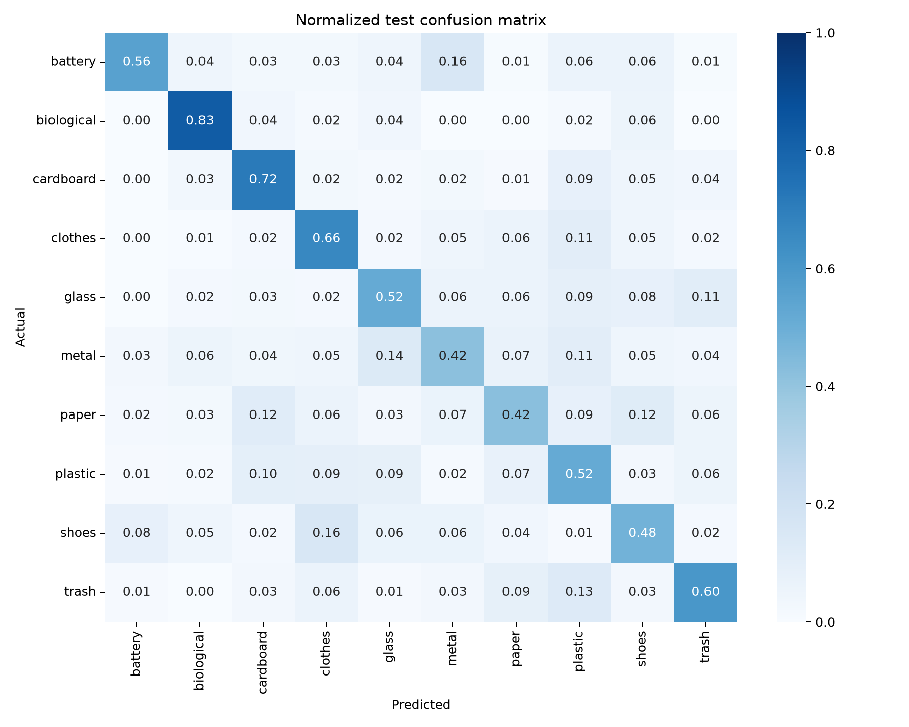
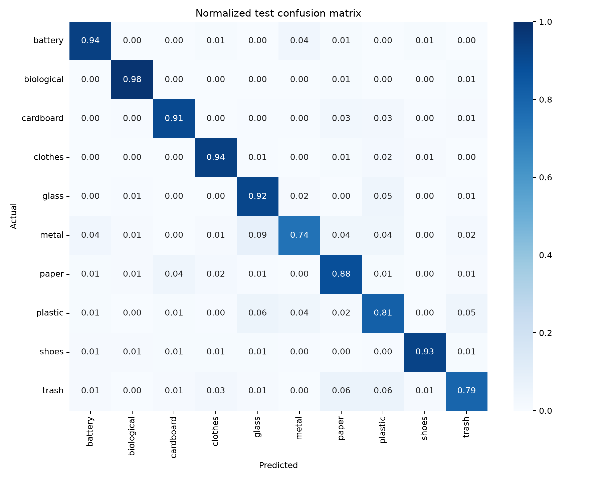

# Full-dataset model comparison

I trained both models against the same fixed split from `data/processed/splits.csv` and selected checkpoints by validation macro-F1. Test metrics below were produced from the selected checkpoints, not from the final training epoch.

## Result

| Model | Parameters | Best epoch | Validation macro-F1 | Test accuracy | Test macro-F1 |
| --- | ---: | ---: | ---: | ---: | ---: |
| Custom CNN | 1,175,786 | 17 / 20 | 56.2% | 56.4% | 55.7% |
| ResNet18 (ImageNet weights) | 11,181,642 | 7 / 11 | 89.4% | 89.0% | 87.7% |

ResNet18 improved test macro-F1 by 32.0 percentage points. The custom CNN struggled most with metal, paper, and trash. Transfer learning raised every class F1 score; metal remained the weakest ResNet18 class at 78.5% F1.

## Evaluation setup

- Dataset: 12,259 images across 10 waste classes
- Split: 8,581 train / 1,839 validation / 1,839 test
- Input: 224 × 224 RGB, ImageNet normalization
- Loss: class-weighted cross-entropy
- Optimizer: AdamW with validation-driven learning-rate reduction
- Checkpoint rule: highest validation macro-F1
- Hardware: Apple Metal Performance Shaders (MPS)
- Seed: 42

Macro-F1 is the primary comparison metric because the class counts are uneven. Accuracy is included as a familiar secondary measure.

## Limitations

- These are single-seed results, so they do not show run-to-run variance.
- ResNet18 starts with ImageNet weights while the custom CNN starts from random weights. This measures the practical value of transfer learning, not architecture alone.
- The held-out split was also used by the earlier baseline notebook and pipeline smoke checks. It was not used for checkpoint selection in these full runs, but it is not a pristine test set for the project as a whole.

## Confusion matrices

Values are normalized by actual class, so each row sums to 1.

### Custom CNN



### ResNet18



## Reproduce the runs

```bash
python experiments/train_full_comparison.py --model custom_cnn --epochs 20 --batch-size 64 --num-workers 4
TORCH_HOME=models/torch-cache python experiments/train_full_comparison.py --model resnet18 --epochs 12 --batch-size 64 --num-workers 4
```

The pretrained ResNet18 command downloads torchvision's published ImageNet weights on its first run. Raw images, downloaded weights, and trained checkpoints are intentionally excluded from Git. Metrics, per-class reports, epoch histories, predictions, and confusion matrices are kept in this directory.
